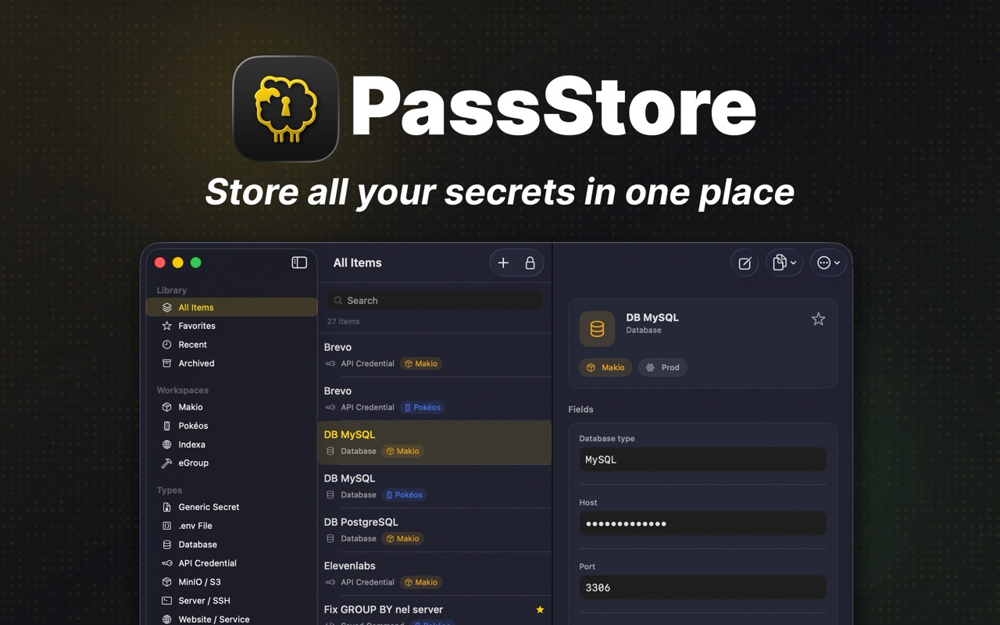

# PassStore

A local-first secret manager for developers, built natively for macOS.

PassStore keeps your API keys, database credentials, S3 configs, SSH logins, .env values, and other project secrets encrypted locally on your Mac. No cloud sync. No external backend. No analytics.

[](https://passstore.makio.app)



## Features

- **Workspaces** to organize secrets by project
- **Multiple secret types:** Generic, .env Group, Database, API Credential, MinIO/S3, Server/SSH, Website/Service, Custom Templates
- **Dynamic fields** with configurable types (text, secret, URL, number, multiline, JSON)
- **Encrypted vault** with AES-256-GCM and Argon2id key derivation
- **macOS Keychain** integration for secure key storage
- **Touch ID** biometric unlock
- **Command palette** with global keyboard shortcut (Cmd+Opt+P)
- **Menu bar** quick access panel
- **Clipboard auto-clear** after copying secrets
- **Auto-lock** with configurable inactivity timeout
- **Encrypted backup** export/import (.pstore format)
- **.env file import**
- **Copy as** .env, JSON, or database connection string
- **Search and filter** by title, tags, fields, environment
- **Password generator**
- **Custom templates** for reusable secret types

## Security

PassStore protects your secrets with industry-standard cryptography:

- **AES-256-GCM** symmetric encryption (Apple CryptoKit)
- **Argon2id** memory-hard key derivation (libsodium)
- **macOS Keychain** for local key storage
- **Touch ID** biometric protection via Secure Enclave

Your password never encrypts data directly: it derives a key that unwraps a separate vault key. See [SECURITY.md](SECURITY.md) for the in-repo technical summary and [passstore.makio.app/security](https://passstore.makio.app/security) for the full narrative (threat model, session, clipboard, updates).

## Requirements

- **macOS 26.0** or later
- A recent **Xcode** that supports that SDK

## Building from Source

1. Clone the repository:
   ```bash
   git clone https://github.com/ilmakio/PassStore.git
   cd PassStore
   ```

2. Open `PassStore.xcodeproj` in Xcode

3. Select your development team in **Signing & Capabilities** for each target (PassStore, PassStoreTests, PassStoreUITests)

4. Build and run (Cmd+R)

### Dependencies

Dependencies are managed via Swift Package Manager and resolved automatically by Xcode:

- [Sparkle](https://github.com/sparkle-project/Sparkle) - Auto-update framework
- [swift-sodium](https://github.com/jedisct1/swift-sodium) - Libsodium bindings for Argon2id

### Note for Forks

The official build includes Sparkle auto-update configured for the PassStore distribution channel. If you fork the project, you should either generate your own Sparkle EdDSA keys or disable the update check.

## Architecture

PassStore follows a clean **MVVM** architecture:

```
PassStore/
├── App/           # App entry point, delegates, commands, Sparkle
├── Domain/        # Models, enums, protocols
├── Data/          # Repositories, security, storage, import/export
├── Presentation/  # Views, view models, components, menu bar
└── Support/       # Utilities, preview data, UTType definitions
```

## Contributing

See [CONTRIBUTING.md](CONTRIBUTING.md) for guidelines on reporting bugs, suggesting features, and submitting pull requests.

## Security Policy

See [SECURITY.md](SECURITY.md) for how to report vulnerabilities.

## License

[MIT](LICENSE)
