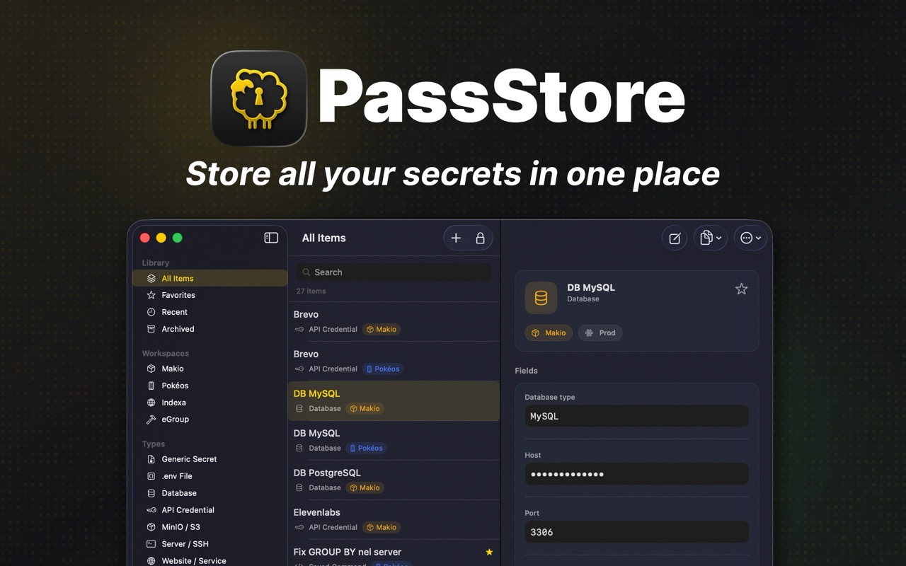

# PassStore

[](https://github.com/ilmakio/PassStore/actions/workflows/ci.yml)

A local-first secret manager for developers, built natively for macOS.

PassStore keeps your API keys, database credentials, S3 configs, SSH logins, .env values, and other project secrets encrypted locally on your Mac. No cloud sync. No external backend. No analytics.

[](https://passstore.makio.app)



## Features

- **Workspaces** to organize secrets by project
- **Multiple secret types:** Generic, .env Group, Database, API Credential, MinIO/S3, Server/SSH, Website/Service, Saved Command, Custom Templates
- **Dynamic fields** with configurable types (text, secret, URL, number, multiline, JSON, one-time code)
- **Time-based one-time codes (TOTP)** from a setup key, an `otpauth://` link or a QR code, with copy limited to the digits
- **Expiry dates** for the credentials that stop working on a date somebody else chose
- **Recently Deleted**, so a deleted secret is recoverable for 30 days
- **Encrypted vault** with AES-256-GCM and Argon2id key derivation
- **macOS Keychain** integration for secure key storage
- **Touch ID** biometric unlock, offered automatically on launch and on focus
- **Linked `.env` files:** keep a reference to the file an item came from and update it in one click, in either direction
- **Item history** with previous values, so a rotated secret can be looked up or restored
- **Command palette** with global keyboard shortcut (Cmd+Opt+P) — no Accessibility permission required
- **Menu bar** quick access panel
- **Clipboard auto-clear** after copying secrets
- **Auto-lock** on inactivity, and on sleep / screen lock
- **Encrypted backup** export/import (.pstore format) with a merge-or-replace preview
- **.env file import**
- **Copy as** .env, JSON, or database connection string
- **Search and filter** by title, tags, fields, environment
- **Vault health** report for reused, weak, expiring, expired and stale secrets, scored by entropy
- **Generators** for passwords, passphrases, hex, base64, URL-safe base64 and UUIDs, with the bits of randomness stated
- **Import from developer tools:** `~/.aws/credentials`, `.netrc`, Docker `config.json`, unencrypted Bitwarden exports
- **Scan a folder** for stored secrets sitting in its files in plaintext
- **Choose where the vault file lives**, so any folder you already sync gives you the same vault on another Mac — with a conflict prompt instead of a silent overwrite
- **Remappable global shortcut**, open at login, and an optional menu-bar-only mode
- **Custom templates** for reusable secret types
- **Bulk edit** across a multi-selection

## Security

PassStore protects your secrets with industry-standard cryptography:

- **AES-256-GCM** symmetric encryption (Apple CryptoKit)
- **Argon2id** memory-hard key derivation (libsodium)
- **macOS Keychain** for local key storage
- **Touch ID** biometric protection via Secure Enclave

Your password never encrypts data directly: it derives a key that unwraps a separate vault key. See [SECURITY.md](SECURITY.md) for the in-repo technical summary and [passstore.makio.app/security](https://passstore.makio.app/security) for the full narrative (threat model, session, clipboard, updates).

## Requirements

- **macOS 26.0** or later
- A recent **Xcode** that supports that SDK

## Building from Source

1. Clone the repository:
   ```bash
   git clone https://github.com/ilmakio/PassStore.git
   cd PassStore
   ```

2. Open `PassStore.xcodeproj` in Xcode

3. Select your development team in **Signing & Capabilities** for each target (PassStore, PassStoreTests, PassStoreUITests)

4. Build and run (Cmd+R)

### Unsigned CLI Verification

For deterministic local verification and GitHub Actions, use the unsigned build-and-unit-test lane:

```bash
xcodebuild build-for-testing \
  -project PassStore.xcodeproj \
  -scheme PassStore \
  -destination 'platform=macOS' \
  CODE_SIGNING_ALLOWED=NO \
  CODE_SIGNING_REQUIRED=NO \
  CODE_SIGN_IDENTITY=''

xcodebuild test-without-building \
  -project PassStore.xcodeproj \
  -scheme PassStore \
  -destination 'platform=macOS' \
  -only-testing:PassStoreTests \
  CODE_SIGNING_ALLOWED=NO \
  CODE_SIGNING_REQUIRED=NO \
  CODE_SIGN_IDENTITY=''
```

This compiles the full scheme without signing and runs the unit test bundle. Signed direct-download builds and macOS UI test runs still require your own team, provisioning, notarization, and Sparkle configuration.

### Dependencies

Dependencies are managed via Swift Package Manager and resolved automatically by Xcode:

- [Sparkle](https://github.com/sparkle-project/Sparkle) - Auto-update framework
- [swift-sodium](https://github.com/jedisct1/swift-sodium) - Libsodium bindings for Argon2id

### Note for Forks

The official build includes Sparkle auto-update configured for the PassStore distribution channel. If you fork the project, you should either generate your own Sparkle EdDSA keys or disable the update check.

## Architecture

PassStore follows a clean **MVVM** architecture:

```
PassStore/
├── App/           # App entry point, delegates, commands, Sparkle
├── Domain/        # Models, enums, protocols
├── Data/          # Repositories, security, storage, import/export
├── Presentation/  # Views, view models, components, menu bar
└── Support/       # Utilities, preview data, UTType definitions
```

## Contributing

See [CONTRIBUTING.md](CONTRIBUTING.md) for guidelines on reporting bugs, suggesting features, and submitting pull requests.

## Security Policy

See [SECURITY.md](SECURITY.md) for how to report vulnerabilities.

## License

[MIT](LICENSE)
